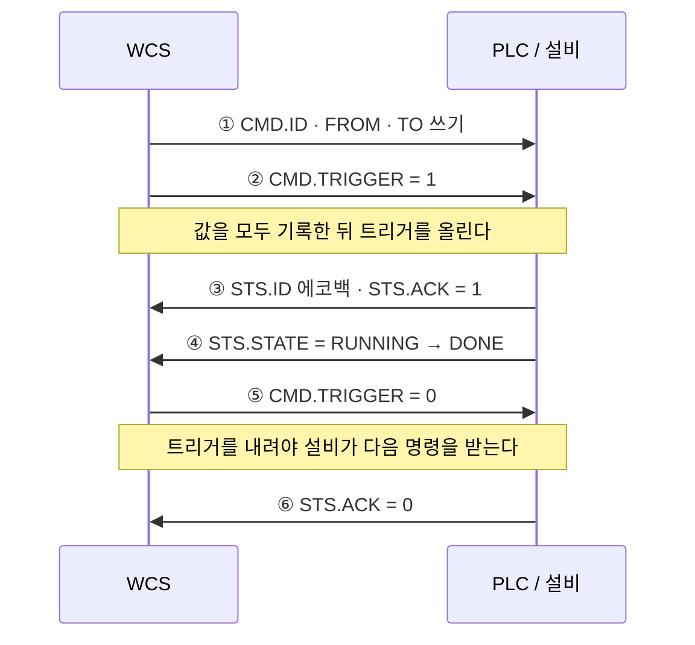
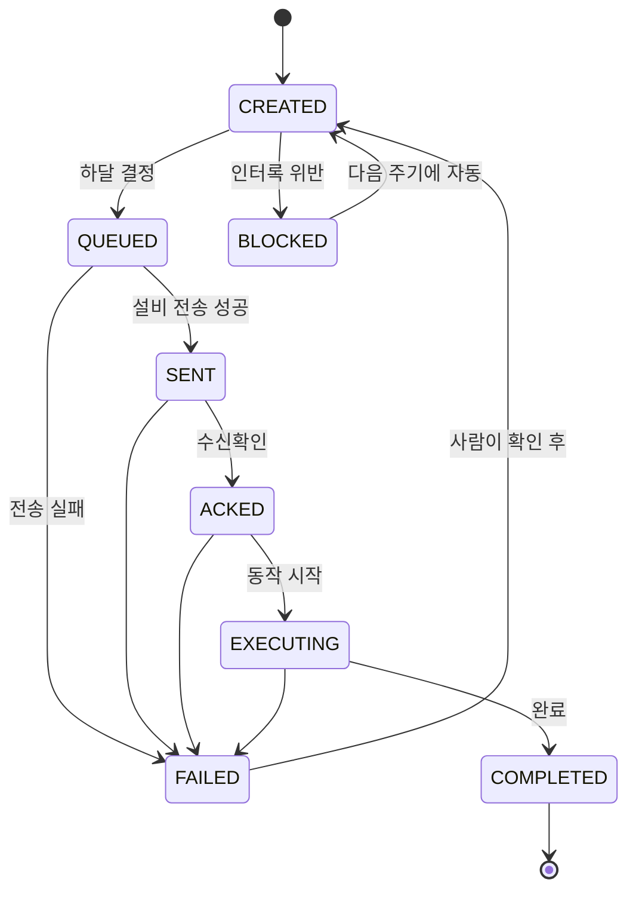

# wcs-poc

자동창고(AS/RS)에서 반출된 화물이 컨베이어를 거쳐 소터로 분류되기까지의 제어 흐름을 구현한 PoC.
상위 시스템과 설비 사이에서 WCS가 담당하는 판단을 코드로 확인하는 것이 목적이다.

> **WCS (Warehouse Control System) proof of concept.**
> Accepts outbound orders from a WMS, expands each into equipment tasks along a route
> derived from the warehouse layout, and dispatches them one cycle at a time while
> respecting equipment and station interlocks. Equipment communication is behind a port,
> so a simulated PLC gateway is swapped in where a real one would go.
> Java 17 · Spring Boot 3 · JPA/H2 · React. 147 tests, none of which start a container.

Java 17 · Gradle · Spring Boot 3.3 · Spring Data JPA · H2 · React 19 + Vite

---

## 배경

물류 시스템은 계층으로 나뉜다. 위로 갈수록 "무엇을 어디로", 아래로 갈수록 "어떻게 언제"를 다룬다.

```
 ERP / WMS     재고 · 주문 · 로케이션 할당
     │  작업지시                    ▲  상태 · 완료
     ▼                             │
 WCS / MCS     작업 순서 · 설비 조율      ← 구현 대상
     │  태그 write                  ▲  태그 read
     ▼                             │
 PLC           실시간 제어 · 스캔 사이클
     │  출력                        ▲  센서 입력
     ▼                             │
 설비           스태커크레인 · 컨베이어 · 소터
```

WMS 계층은 실무에서 다뤄왔다. 그 아래 제어 계층을 직접 구현해 보기 위해 이 저장소를 만들었다.

---

## 범위

설비가 하나면 조율할 대상이 없다. 크레인·컨베이어·소터 세 종이 이어지는 구간을 대상으로 잡았다.


| 구현 | 제외 |
|---|---|
| 지시 → 경로 → 설비 작업 전개 | 입고측 흐름 |
| 핸드셰이크 · 인터록 · 판단 주기 | 웨이브 운영 · 경로 최적화 |
| 컷오프 우선순위 · 설비/자리 정원 | 인증 / 권한 |
| 설비 상태 블록 조회 · 관제 화면 | 실물 PLC 통신 |

### P&D 스테이션

크레인과 컨베이어가 만나는 지점으로, 화물의 담당 설비가 바뀌는 자리다.
인수인계를 신호로 확인하지 않으면 빈 자리에 포크를 뻗거나, 아직 비워지지 않은 자리에 다음 화물이 들어간다.

**설비 정원과 자리 정원은 다르다.** 크레인 작업이 끝나도 화물은 P&D에 남아 있으므로,
설비는 비었는데 자리가 차서 하달이 막히는 상태가 존재한다.

### 슈트와 차량

슈트 하나는 도크 및 차량 한 대에 대응한다. 슈트 번호는 배차 계획에서 결정된다.
따라서 차량 출발 시각(컷오프)이 작업 우선순위의 기준이 된다.

---

## 설비 연동

### 핸드셰이크

작업 지시는 단방향 전달이 아니라 지시 → 수신확인 → 실행 → 완료의 왕복으로 처리한다.



②를 먼저 올리면 설비가 목적지 값이 채워지지 않은 명령을 읽는다.
⑤를 생략하면 설비가 명령 슬롯을 물고 있어 다음 작업을 받지 못한다.

③의 **에코백**이 짝맞춤의 근거다. 우리가 쓴 `CMD.ID`와 돌아온 `STS.ID`가 같아야
이 응답이 방금 내린 명령에 대한 것이다.

코드에서는 `EquipmentGateway`의 세 메서드가 이 순서를 나눠 갖는다.

| 메서드 | 대응 |
|---|---|
| `send(task)` | ① ② |
| `read(taskNo)` | ③ ④ |
| `readStatus(code)` | STS 태그 블록 전체 — 위치 · 모드 · 알람 · 사이클 |
| `release(taskNo)` | ⑤ |

### 작업 상태

위 순서를 타입으로 강제한다. 정의되지 않은 전이는 예외로 거부한다.
완료 신호를 수신하지 않은 작업이 완료로 기록되는 상황을 차단하기 위한 것이다.



설비 점유를 이유로 작업을 거절하지 않는다. 컨베이어에 이미 투입된 화물은 회수할 수 없기 때문이다.
차단해 두었다가 조건이 풀리면 컷오프가 임박한 작업부터 하달한다.

### 인터록

물리적으로 불가능한 지시를 설비에 전달하기 전에 차단한다.
사유는 상태에 남겨 조치할 수 있게 한다.

| 사유 | 판정 | 결과 |
|---|---|---|
| `EQP_BUSY` | 설비 정원이 참 | `BLOCKED` — 다음 주기에 재시도 |
| `DEST_OCCUPIED` | 목적지 자리가 차 있음 | `BLOCKED` — 다음 주기에 재시도 |
| `SEND_FAILED` | 명령 전송 실패 | `FAILED` — 사람이 확인 |
| `EQP_FAULT` | 설비가 이상 신호를 올림 | `FAILED` — 사람이 확인 |

앞 구간이 끝나지 않은 작업은 **차단이 아니라 후보에서 빠진다.**
조건 위반이 아니라 아직 차례가 아닌 것이기 때문이다.

**인터록 대기에는 횟수 제한을 두지 않는다.** 통로가 붐비면 열 번도 기다린다.
한도를 두었다가 정상 물량이 조건 해소 후에도 나가지 않는 것을 발견해 걷어냈다.
(ADR-0013)

---

## 구조

```
src/main/java/io/github/hhhjbot/wcs/
  domain/    업무 규칙. 프레임워크를 모른다. 애너테이션이 하나도 없다
  app/       조율 — 판단 주기 · 조회 · 시연 구성
  infra/     바깥과 통신하는 구현 — JPA 저장소 · 모의 설비
  web/       REST 노출
  config/    빈 조립
web/         React 관제 화면 (Vite)
tools/       콘솔 데모
docs/        설계 문서
```

의존은 한 방향이다. `web` · `app` · `config` · `infra`가 모두 `domain`을 향하고,
`domain`에서 나가는 화살표는 없다.

저장소와 설비 통신이 `OrderRepository` · `EquipmentGateway`라는 **인터페이스로 도메인 안에
선언**되어 있고 구현만 바깥에 있기 때문이다. 테스트 147개가 컨테이너 없이 도는 이유이기도 하다.

| 인터페이스 (domain) | 운영 구현 (infra) | 테스트 구현 |
|---|---|---|
| `OrderRepository` | `JpaOrderRepository` — H2 | `InMemoryOrderRepository` |
| `EquipmentGateway` | `SimulatedEquipmentGateway` | `EquipmentGateway.NOOP` |

---

## 실행

Gradle Wrapper를 사용한다. Gradle을 별도로 설치할 필요는 없다.

```bash
./gradlew test        # 147
./gradlew bootRun     # 1번 창 — http://localhost:8080
```

```bash
cd web
npm install
npm run dev           # 2번 창 — http://localhost:5173
```

화면 없이 콘솔로만 흐름을 보려면:

```bash
./gradlew classes
javac -encoding UTF-8 -d out -cp build/classes/java/main tools/ScenarioRun.java
java -cp "out:build/classes/java/main" ScenarioRun
```

### 기동 직후

`DemoScenario`가 시연 지시 세 건을 접수하고, `EquipmentPoller`가 1초마다 판단 주기를 돌린다.
아무것도 누르지 않아도 화물이 랙에서 슈트까지 흘러간다.

```
시연 지시 3건 접수 — [TO-00001, TO-00002, TO-00003]
주기 — 하달 2건 · 대기 1건 · 응답 0건
주기 — 하달 0건 · 대기 1건 · 응답 2건
```

세 건은 한 주기에 세 가지를 동시에 드러내도록 구성했다.

| 지시 | 출발 | 컷오프 | 보이는 것 |
|---|---|---|---|
| TO-00001 | A-01-03 | 16:00 | |
| TO-00002 | A-01-05 | **15:00** | 나중에 등록됐지만 먼저 나간다 |
| TO-00003 | A-02-04 | 17:00 | 크레인이 달라 병렬로 나간다 |

TO-00002와 TO-00003은 인덕션(정원 1)에서 한 줄로 선다. **병목은 크레인이 아니라 인덕션이다.**

### API

```
GET  /api/tasks                                   작업 전체
GET  /api/tasks?equipment=CV-01                   설비별
GET  /api/tasks?order=TO-00001                    지시별
GET  /api/tasks/TO-00001-2                        한 건
GET  /api/equipments                              설비 정원 + STS 태그 블록
GET  /api/stations                                자리 점유
GET  /api/routes?source=A-01-03-02&chute=CHUTE-3  경로 조회

POST /api/orders                                  지시 접수
POST /api/dispatch                                한 주기 수동 실행
GET  /api/polling · POST /api/polling             자동/수동 전환
POST /api/demo                                    시연 지시 한 묶음 추가
POST /api/reset                                   처음 상태로
```

H2 콘솔은 `http://localhost:8080/h2-console` (JDBC URL `jdbc:h2:mem:wcs`, 사용자 `sa`).

---

## 화면

`web/`의 React 관제 화면에서 지시를 넣고 주기를 돌려볼 수 있다.

설비 카드 한 줄에 **출처가 다른 두 값**이 나란히 놓인다.
왼쪽 `1/1`은 WCS가 작업 목록에서 세어 낸 값이고, 오른쪽 위치·모드·명령은 설비가 STS 태그로 내놓은 값이다.
어긋나면 그 자체가 신호다 — 진행 중이 1인데 설비가 대기면 명령이 유실된 것이다.

**자동/수동 토글은 서버의 폴러를 실제로 멈춘다.** 화면에서만 껐다 켜면 자동 주기가 계속 지나가
수동 하달이 의미를 잃기 때문이다.

빌드 결과는 `src/main/resources/static/`으로 떨어지므로,
`npm run build` 후에는 `bootRun` 하나로 화면까지 뜬다.

---

## 테스트

```bash
./gradlew test        # 147
```

전부 도메인 테스트이고 스프링 컨텍스트를 띄우는 것은 하나도 없다.

`OutboundFlowConcurrencyTest`는 스레드 넷이 같은 순간에 하달을 시도하게 만들어
인터록이 지켜지는지 본다. 잠그기 전 3000판을 돌렸을 때 1721판에서 어긋났고,
증상은 정원 초과보다 **두 스레드가 같은 작업을 집는 형태**로 먼저 나타났다.

잠금은 세 층에 각각 다른 이유로 걸려 있다.

| | 무엇을 지키나 |
|---|---|
| `EquipmentTask` — `synchronized` | 한 객체의 필드 가시성 |
| `TaskList` — `CopyOnWriteArrayList` | 순회 중 추가돼도 예외가 안 남 |
| `OutboundFlow` — `synchronized dispatch` | "세고 → 판단하고 → 쓰기"가 안 끊김 |

세 번째가 본체다. 앞의 둘만으로는 각 호출이 안전해져도 호출 **사이**가 잠기지 않는다.

---

## 문서

| | |
|---|---|
| [설계결정.md](docs/설계결정.md) | 선택지가 여럿이었던 판단과 근거 (ADR 13건) |
| [코드-읽기-지도.html](docs/코드-읽기-지도.html) | 기동 타임라인 · 진입점 · 어떤 순서로 읽을지 |
| [화물-한-건의-여정.html](docs/화물-한-건의-여정.html) | 호출 추적 · 클래스별 판단 · 실측 15주기 표 |
| [nestjs-vs-spring.md](docs/nestjs-vs-spring.md) | NestJS 경험을 스프링으로 옮기며 정리한 차이 |

HTML 문서는 내려받아 브라우저로 열면 된다. 외부 자원 없이 단독으로 렌더된다.

---

## 한계

실물 설비가 없다. 아래는 모르는 것이 아니라 **범위에서 뺀 것**이다.

| | |
|---|---|
| 실물 PLC 통신 | 시뮬레이터가 태그 블록 형식으로 값을 낸다. 실물은 PLC4X 등으로 같은 인터페이스를 구현하면 된다 |
| 소터 목적지 실시간 변경 | 경로가 접수 시점에 확정된다. 실제 소터는 바코드를 읽는 순간 슈트를 정한다 |
| 작업 영속화 | 지시는 H2에 남고 작업은 메모리에 있다. 옮기려면 기동 시 재전개 규칙이 필요하다 |
| 슈트 반출 입력 | 화물이 슈트를 떠나는 것은 WCS 밖의 사건이라 알려주는 입력이 필요하다 |
| 합류 제어 | P&D별 인피드 스퍼를 컨베이어 한 대로 뭉갰다. 갭 확보·라인 압력이 없다 |
| 우선순위 최적화 | 매 주기 컷오프 이른 것부터 내는 탐욕적 방식이다. 웨이브·배칭은 없다 |
| 설비 상태 존별 분리 | 컨베이어는 정원 8인데 상태 블록이 하나다. 실물은 존마다 태그가 따로 있다 |
| 시한 초과 판정 | 컷오프는 하달 순서에만 쓰인다. 초과를 실패로 올리려면 시계를 주입해야 한다 |

래더 프로그래밍, 전기 배선, 설비 구성, 시운전은 다루지 않는다.
모든 데이터는 임의로 생성한 값이다.
