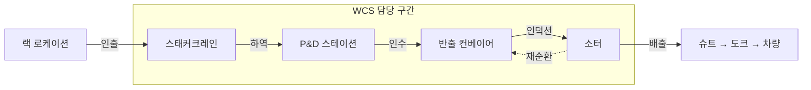
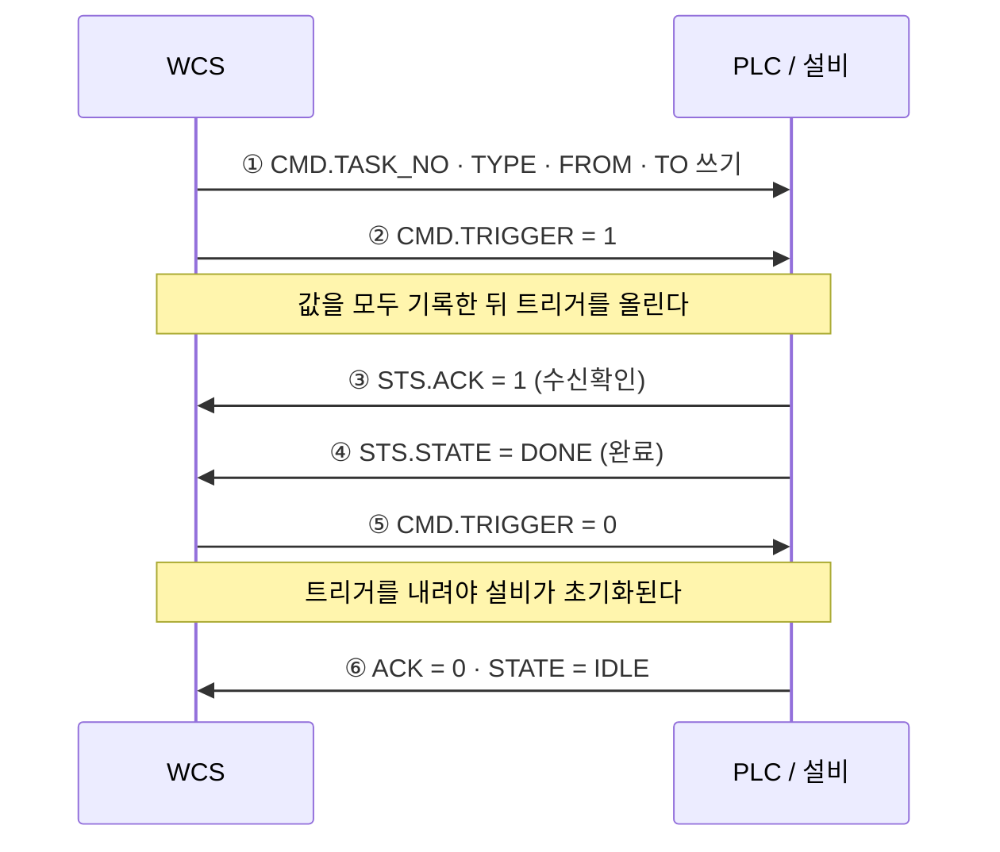
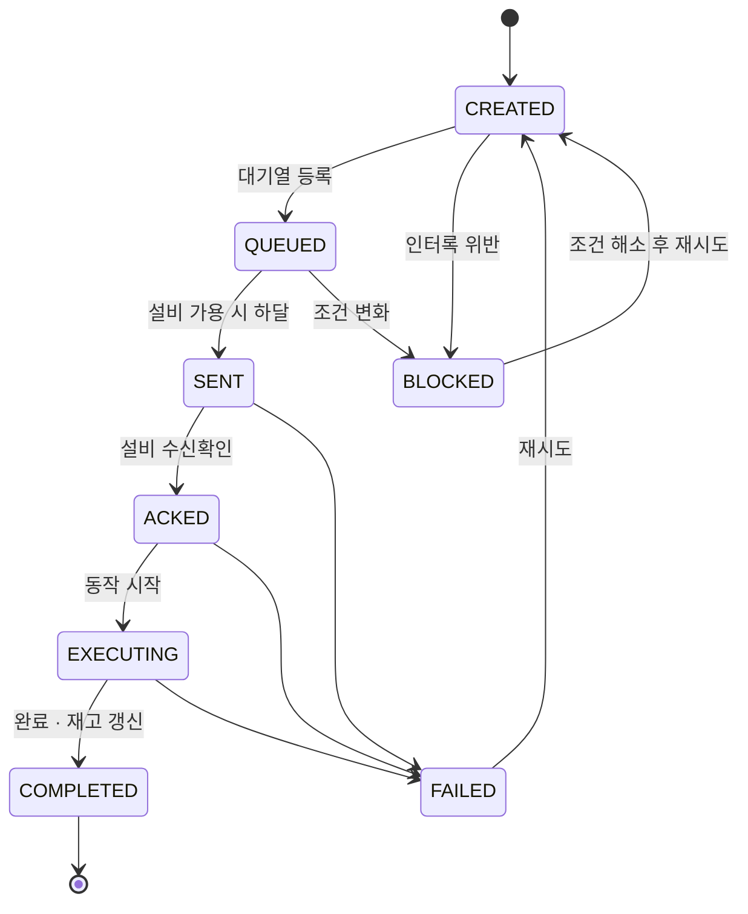

# wcs-poc

자동창고(AS/RS)에서 반출된 물품이 컨베이어를 거쳐 소터로 분류되기까지의 제어 흐름을 구현한 PoC.
상위 시스템과 설비 사이에서 WCS가 담당하는 역할을 코드로 확인하는 것이 목적이다.

Java 17 · Gradle · Spring Boot 3 · Spring Data JPA · H2
(Spring 의존성은 3단계에서 추가한다. 현재 도메인 계층은 표준 라이브러리만 사용한다.)

---

## 배경

물류 시스템은 계층으로 나뉜다. 위로 갈수록 "무엇을 어디로", 아래로 갈수록 "어떻게 언제"를 다룬다.

```
 ERP / WMS     재고 · 주문 · 로케이션 할당
     │  작업지시                    ▲  상태 · 완료
     ▼                             │
 WCS / MCS     작업 순서 · 설비 조율      ← 구현 대상
     │  태그 write                  ▲  태그 read
     ▼                             │
 PLC           실시간 제어 · 스캔 사이클
     │  출력                        ▲  센서 입력
     ▼                             │
 설비           스태커크레인 · 컨베이어 · 소터
```

WMS 계층은 실무에서 다뤄왔다. 그 아래 제어 계층을 직접 구현해 보기 위해 이 저장소를 만들었다.

---

## 범위

설비가 하나면 조율할 대상이 없다. 크레인·컨베이어·소터 세 종이 이어지는 구간을 대상으로 잡았다.



| 구현 | 제외 |
|---|---|
| 핸드셰이크 · 인터록 · 스캔 사이클 | 입고측 흐름 |
| 위치 추적 · 슈트 배정 · 재순환 | 웨이브 운영 · 경로 최적화 |
| 작업 대기열 · 컷오프 우선순위 | 인증 / 권한 |

### P&D 스테이션

크레인과 컨베이어가 만나는 지점으로, 케이스의 담당 설비가 바뀌는 자리다.
인수인계를 신호로 확인하지 않으면 빈 자리에 포크를 뻗거나, 아직 비워지지 않은 자리에 다음 케이스가 들어간다.

### 슈트와 차량

슈트 하나는 도크 및 차량 한 대에 대응한다. 슈트 번호는 배차 계획에서 결정된다.
따라서 차량 출발 시각(컷오프)이 작업 우선순위의 기준이 된다.

---

## 설비 연동

### 핸드셰이크

작업 지시는 단방향 전달이 아니라 지시 → 수신확인 → 실행 → 완료의 왕복으로 처리한다.



②를 먼저 올리면 설비가 목적지 값이 채워지지 않은 명령을 읽을 수 있다.
⑤를 생략하면 설비가 ACK를 유지한 채로 남아 다음 작업을 받지 못한다.

### 작업 상태

위 순서를 타입으로 강제한다. 정의되지 않은 전이는 예외로 거부한다.
완료 신호를 수신하지 않은 작업이 완료로 기록되는 상황을 차단하기 위한 것이다.



설비 점유를 이유로 작업을 거절하지 않는다. 컨베이어에 이미 투입된 물품은 회수할 수 없기 때문이다.
대기열에 등록한 뒤 설비가 가용해지면 컷오프가 임박한 작업부터 하달한다.

### 인터록

물리적으로 불가능하거나 위험한 지시를 PLC에 전달하기 전에 차단한다.

| 코드 | 차단 대상 |
|---|---|
| `PLC_OFFLINE` | 통신 두절 상태에서의 지시 하달 |
| `EQP_FAULT` | 이상 상태 설비로의 작업 투입 |
| `SOURCE_EMPTY` | 재고가 없는 로케이션에서의 반출 |
| `PND_OCCUPIED` | 이전 케이스가 남아 있는 P&D로의 하역 |
| `CHUTE_FULL` | 만재 상태 슈트로의 배출 |

위반 사유는 전부 수집해 반환한다. 조치할 항목을 한 번에 파악할 수 있어야 하기 때문이다.
차단된 작업은 폐기하지 않고 상태로 보존해 조건 해소 후 재시도할 수 있게 한다.

---

## 설계 결정

선택지가 여럿이었던 판단은 별도로 기록한다 → [`docs/설계결정.md`](docs/설계결정.md)

---

## 진행 상황

| 단계 | 내용 | 상태 |
|---|---|---|
| 1 | 범위 정의 · 설계 문서화 | 완료 |
| 2 | 도메인 — 상태 전이 · 로케이션 주소 · 슈트 배정 | 상태 전이 완료 |
| 3 | 설비 시뮬레이터 — 크레인 핸드셰이크 | |
| 4 | 작업 대기열 · 컷오프 우선순위 | |
| 5 | P&D 인수인계 | |
| 6 | 소터 · 위치 추적 | |
| 7 | 예외 처리 — 노리드 · 만재 · 배출 실패 · 재순환 | |
| 8 | 설비 상태 모니터 | |

---

## 실행

Gradle Wrapper를 사용한다. Gradle을 별도로 설치할 필요는 없다.

```bash
./gradlew test          # 도메인 테스트
```

빌드 도구 없이 규칙만 확인하려면:

```bash
javac -encoding UTF-8 -d out src/main/java/io/github/hhhjbot/wcs/domain/TaskStatus.java
javac -encoding UTF-8 -cp out -d out tools/TaskStatusCheck.java
java -cp out TaskStatusCheck
```

상태 모니터는 정적 HTML과 폴링으로 구성한다.
설비 상태가 수백 ms 단위로 변경되므로 서버사이드 템플릿 방식은 사용하지 않는다.

---

## 한계

- 실제 PLC 또는 OPC UA 서버에 연결하지 않는다. 태그 read/write 흐름을 시뮬레이터로 재현한 것이다.
- 래더 프로그래밍, 전기 배선, 설비 구성, 시운전은 다루지 않는다.
- 모든 데이터는 임의로 생성한 값이다.
